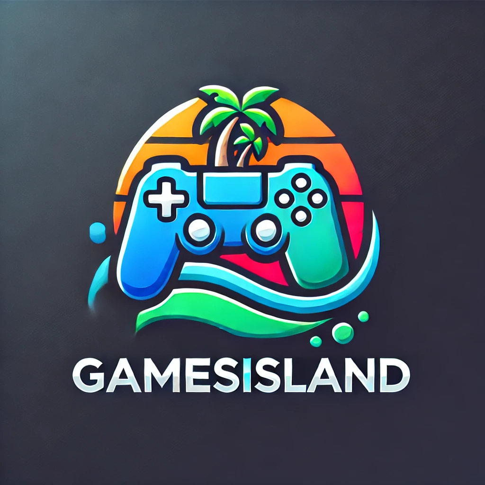

# GamesIsland


Ce projet est un site de bibliothèque de jeux vidéo pour les développeurs de jeux vidéo de l'île de la Réunion 🇷🇪.

## GamesIslandFront

Ce projet a été généré avec [Angular CLI](https://github.com/angular/angular-cli) version 17.2.0.

## Prérequis

- Node.js (version 14 ou supérieure)
- Angular CLI (version 17.2.0 ou supérieure)

## Installation

Clonez le dépôt et installez les dépendances :

```bash
git clone https://github.com/votre-utilisateur/GamesIsland.git
cd GamesIsland-Front
npm install
```
## Développement

```bash
ng serve
```
Naviguez vers http://localhost:4200/. L'application se rechargera automatiquement si vous modifiez l'un des fichiers source.

## Tests Unitaire

```bash
ng test
```

## Fonctionnalités

-Recherche de jeux par titre

-Affichage des résultats de recherche

-Navigation vers les détails des jeux

-Connexion utilisateur 